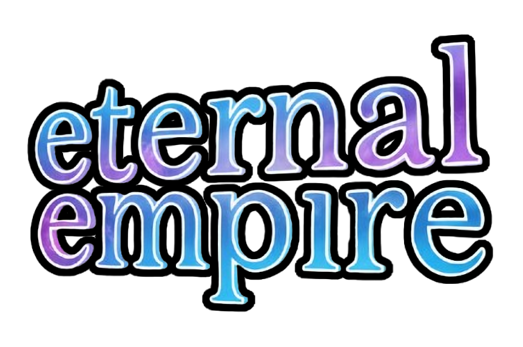

<p align="center">
  
</p>

# eternal empire

[](https://github.com/evilbocchi/eternal-empire/actions/workflows/ci.yml)
[](https://github.com/evilbocchi/eternal-empire/releases/latest)
[](https://www.codefactor.io/repository/github/evilbocchi/eternal-empire)
[](https://discord.gg/https://discord.gg/haPBmCSvXt)

Build your money-making empire. Uncover the world of Obbysia.

## Status

This project is under constant development, and will not stop until the completion of the [EJT Difficulty Chart](https://jtohs-joke-towers.fandom.com/wiki/Eternal_Joke_Towers_(EJT)_Wiki) (at an arbitrary point).

However, note that we strive to maintain things in a stable state. As such, changes in this repository may not impact the main distribution of this project on Roblox immediately.

## Setup

### Prerequisities
- [Node.js 19+](https://nodejs.org/en/download)
- [UI Labs (recommended)](https://ui-labs.luau.page/docs/installation)

### Build

> If you are using VS Code, an [automatic task](.vscode/tasks.json) is run when opening the project folder that sets up the development environment for you.

To set up the development environment for Eternal Empire, follow these steps:

1. Download the development place file from the [sandbox repository](https://github.com/evilbocchi/eternal-empire-sandbox). You will need this to test the game in Roblox Studio.

2. Clone the repository:
    ```sh
    git clone https://github.com/evilbocchi/eternal-empire.git
    cd eternal-empire
    ```

3. Install dependencies:
    ```sh
    npm install
    ```

4. Install Rojo:
    - Rojo is bundled with this project, accessible with `npx rojo`. For operating systems that do not support the existing pre-built binaries, follow the [crates.io installation](https://rojo.space/docs/v7/getting-started/installation/) of Rojo.
    - However, you will need to install the Roblox Studio plugin for Rojo yourself. To do so, either try running `npx rojo plugin install` or follow the [official documentation](https://rojo.space/docs/v7/getting-started/installation/).

5. Run the environment:
    ```sh
    npm run dev
    ```

6. Connect to the Rojo server with the Roblox Studio plugin. Changes made to files in your code editor should now sync with Roblox Studio.

7. You may consider installing the internal tooling plugin for easier development. To build and install the plugin, run:
    ```sh
    npm run plugin
    ```

## Contributing

We warmly welcome contributions to improve Eternal Empire! To contribute:

1. Fork the repository.
2. Create a new branch for your feature or bugfix.
3. Make your changes and commit them with descriptive messages.
4. Push your changes to your fork.
5. Open a pull request to the main repository.

## License

This project is licensed under the Creative Commons Attribution-NonCommercial 4.0 International License.

**You are free to:**
- Use, share, and modify the code for personal or non-commercial purposes.
- Create and distribute mods or derivative works, as long as they are not for commercial use.

**You may not:**
- Use any part of this project or its derivatives for commercial purposes.

See the [LICENSE](LICENSE) file for full details, and thank you for respecting the work that was put into this project.